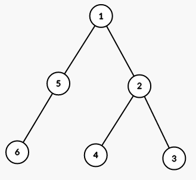
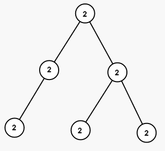
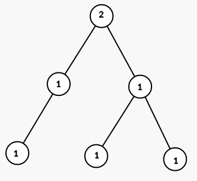

# D - Coloring a Tree

You are given a rooted tree with n vertices. The vertices are numbered from 1 to n, the root is the vertex number 1.

Each vertex has a color, let's denote the color of vertex v by cv. Initially cv = 0.

You have to color the tree into the given colors using the smallest possible number of steps. On each step you can choose a vertex v and a color x, and then color all vectices in the subtree of v (including v itself) in color x. In other words, for every vertex u, such that the path from root to u passes through v, set cu = x.

It is guaranteed that you have to color each vertex in a color different from 0.

You can learn what a rooted tree is using the link: [https://en.wikipedia.org/wiki/Tree\_(graph_theory)](<https://en.wikipedia.org/wiki/Tree_(graph_theory)>).

## Input

The first line contains a single integer $n (2 ≤ n ≤ 10^4)$ - the number of vertices in the tree.

The second line contains $n - 1$ integers $p_{2}, p_{3}, ..., p_{n} (1 ≤ p_{i} < i)$, where $p_{i}$ means that there is an edge between vertices i and $p_{i}$.

## Output

Print a single integer — the minimum number of steps you have to perform to color the tree into given colors.

### Sample 1

| Input       | Output |
| ----------- | ------ |
| 6           | 3      |
| 1 2 2 1 5   |        |
| 2 1 1 1 1 1 |        |

### Sample 2

| Input         | Output |
| ------------- | ------ |
| 7             | 5      |
| 1 1 2 3 1 4   |        |
| 3 3 1 1 1 2 3 |        |

## Note

The tree from the first sample is shown on the picture (numbers are vetices' indices):

On first step we color all vertices in the subtree of vertex 1 into color 2 (numbers are colors):

On second step we color all vertices in the subtree of vertex 5 into color 1:

On third step we color all vertices in the subtree of vertex 2 into color 1:

The tree from the second sample is shown on the picture (numbers are vetices' indices):

On first step we color all vertices in the subtree of vertex 1 into color 3 (numbers are colors):

On second step we color all vertices in the subtree of vertex 3 into color 1:

On third step we color all vertices in the subtree of vertex 6 into color 2:

On fourth step we color all vertices in the subtree of vertex 4 into color 1:

On fith step we color all vertices in the subtree of vertex 7 into color 3:

